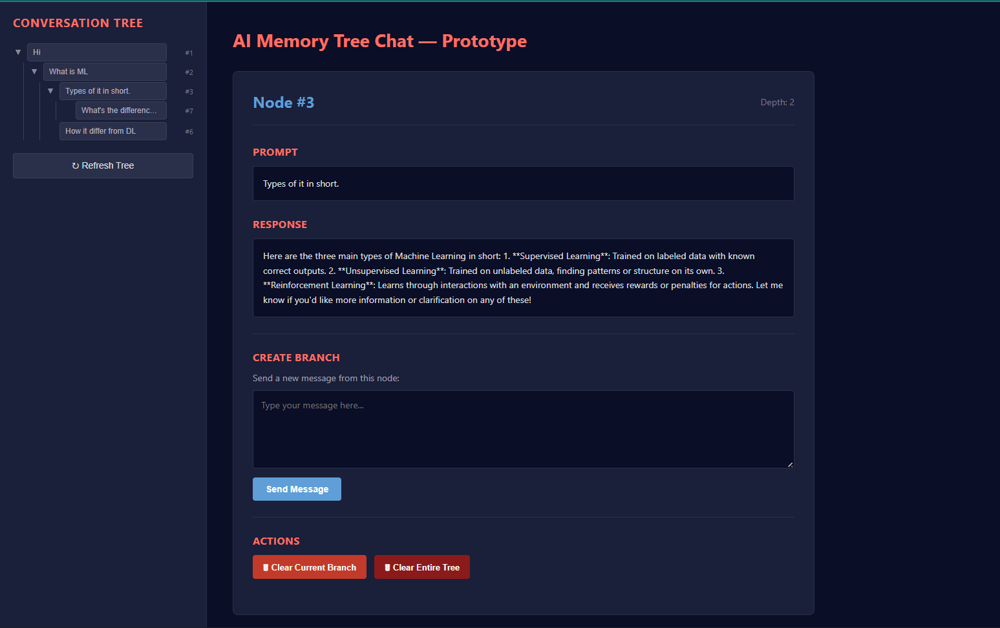

# AI Memory Tree – Branchable LLM Conversations

AI Memory Tree is a prototype chat system that stores conversations as a tree instead of a linear history.
It allows users to jump back to any point and branch conversations without context pollution.

## Features
- Tree-based conversation memory
- Branch and revisit any node
- Clear individual branches or entire tree
- Groq-powered LLM responses
- FastAPI backend + React+vite frontend

## Tech Stack
- FastAPI
- SQLAlchemy + SQLite
- React + Vite
- Groq LLM API (LLaMA 3)

## Status
Prototype – core functionality implemented.
